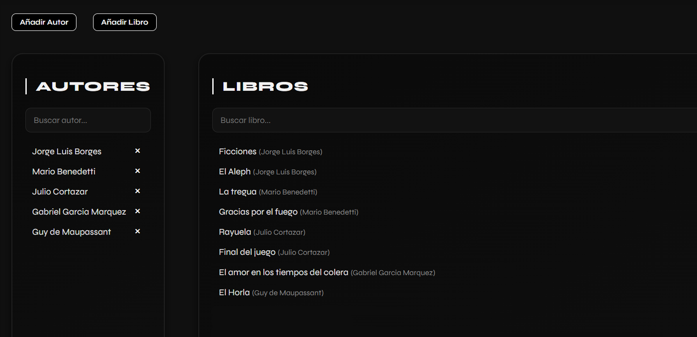

# React Spring Boot Book Manager



> Aplicación completa de gestión de libros y autores.  
> Desarrollada con React en el frontend y Spring Boot en el backend, utilizando MySQL como base de datos relacional. Permite crear, visualizar, filtrar y eliminar libros y autores mediante una interfaz moderna, clara y completamente personalizada con CSS Modules.

---

## Tecnologías

- Frontend: React, Fetch API, CSS Modules  
- Backend: Spring Boot, Spring Data JPA, Hibernate  
- Base de datos: MySQL  
- Control de versiones: Git y GitHub

---

## Funcionalidades

- Listado de autores con buscador en tiempo real  
- Listado de libros con filtrado por autor y búsqueda por título  
- Añadir y eliminar autores con nacionalidad mediante modal  
- Añadir y eliminar libros con año de publicación y autor  
- Interfaz moderna, sin librerías externas de UI  
- Modo responsivo, claro y oscuro integrado en el diseño  
- Backend estructurado con arquitectura RESTful y DTOs

---

## Requisitos previos

- Java 17 o superior  
- Maven  
- Node.js v14+  
- MySQL instalado y ejecutándose en local

---

## Instalación y ejecución
```bash
1. Clonar el repositorio

git clone https://github.com/tu-usuario/react-springboot-book-manager.git
cd react-springboot-book-manager
2. Configurar el backend

cd backend
Asegúrate de tener creada una base de datos MySQL llamada bookdb.
Edita el archivo src/main/resources/application.properties con tus credenciales:

spring.datasource.url=jdbc:mysql://localhost:3306/bookdb?useSSL=false&allowPublicKeyRetrieval=true&serverTimezone=UTC
spring.datasource.username=TU_USUARIO
spring.datasource.password=TU_CONTRASEÑA

spring.jpa.hibernate.ddl-auto=update
spring.jpa.show-sql=true
spring.jpa.properties.hibernate.dialect=org.hibernate.dialect.MySQL8Dialect

server.port=8080
Luego ejecuta:

mvn spring-boot:run

3. Configurar el frontend

cd ../frontend
npm install
npm start
La aplicación estará disponible en http://localhost:3000

Estructura del proyecto
css
Copiar
Editar
react-springboot-book-manager/
├── backend/
│   └── src/main/java/com/bookmanager/
│       ├── controller/
│       ├── dto/
│       ├── model/
│       ├── repository/
│       └── BookManagerApp.java
│   └── resources/
│       └── application.properties
├── frontend/
│   ├── src/
│   │   ├── components/
│   │   ├── App.js
│   │   ├── App.module.css
│   │   └── index.js
│   └── public/
├── .gitignore
└── README.md

Datos de prueba
Puedes poblar la base de datos ejecutando el siguiente script SQL:

INSERT INTO authors (name, nationality) VALUES 
('Jorge Luis Borges', 'argentina'),
('Mario Benedetti', 'uruguaya'),
('Julio Cortazar', 'argentina'),
('Guy de Maupassant', 'francesa');

INSERT INTO books (title, publication_year, author_id) VALUES 
('ficciones', 1944, 1),
('el aleph', 1949, 1),
('la tregua', 1960, 2),
('gracias por el fuego', 1965, 2),
('rayuela', 1963, 3),
('final del juego', 1956, 3),
('bola de sebo', 1880, 4),
('el horla', 1887, 4);
Notas técnicas
Hooks de React para manejo de estado local

Fetch API para comunicación con el backend

DTOs para desacoplar la lógica de entidades

Select controlado dinámicamente

CSS Modules para encapsular y personalizar los estilos

Código modular y limpio tanto en backend como en frontend

Autor
Sergio Godoy
github.com/Blxzz-code
sgdivergente13@gmail.com
